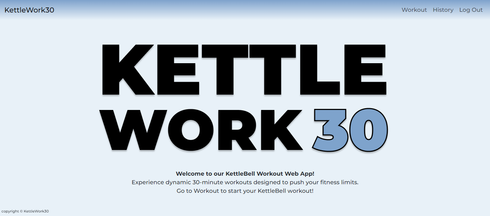
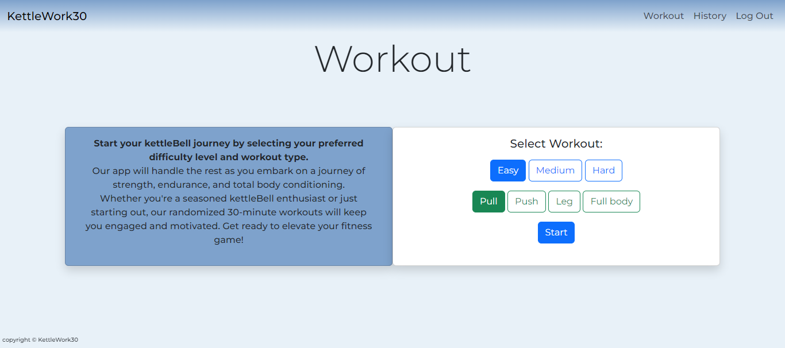
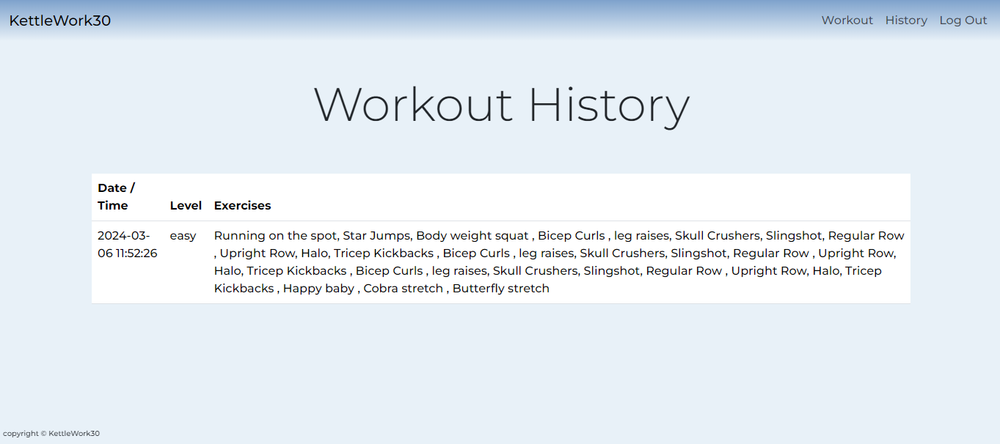
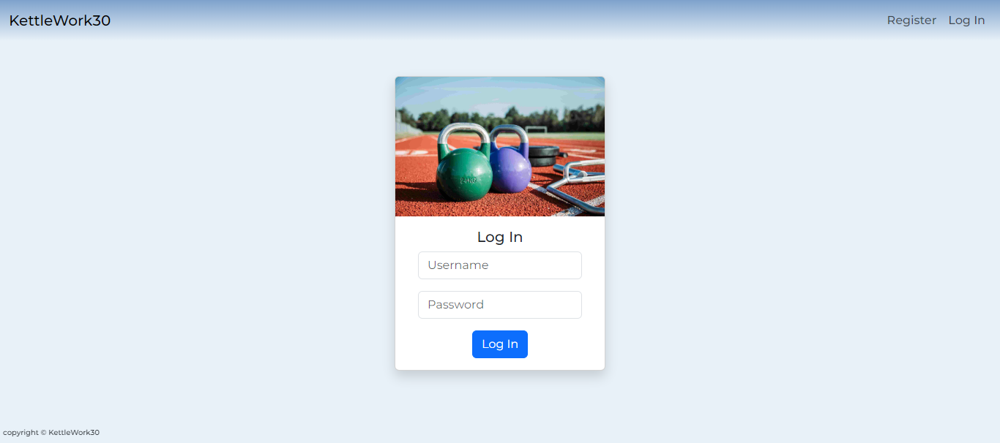
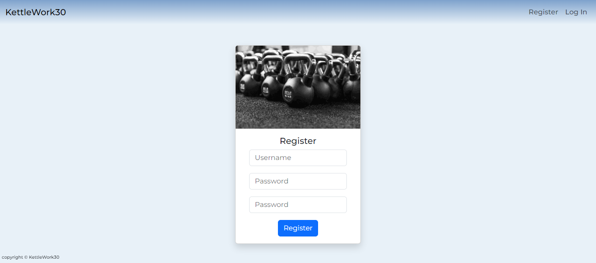
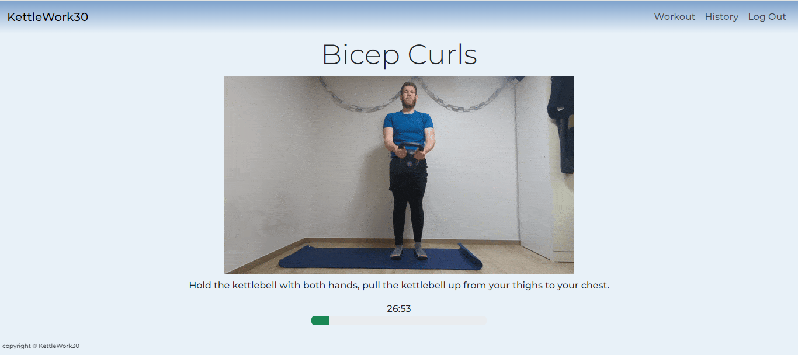

# KettleWork30

## Video Demo: 

[YouTube Link](https://youtu.be/QKvaNgVkPXI?si=dhktOYcDyyFQXBod)

This is a 30-Minute Kettlebell Workout Generator web application! Our platform offers users the flexibility to tailor their workouts according to their fitness levels and preferences. With options ranging from various difficulty levels to workout types including push, pull, legs, and full body routines, users can easily customize their exercise sessions to suit their needs.

## Problem Description
This was mainly a personal problem, to keep costs down i stayed away from a gym membership and purchased a kettlebell instead, but i started getting tired of doing the same youtube workout videos. As i looked around for any workout plans, i found that there was a lot of youtube workouts and blog workouts doing the same thing.

## Solution Approach
So with my final project for Harvard's CS50 coming up and this idea, i decided to created this kettlebell workout generator. This gives a 30-minute kettlebell workout thats generated at random from a database of exercises. Making each workout different every time and less scrolling through youtube videos.


## Model
### index
| logged in                | not logged in          |
| ------------------------ | ---------------------- |
|  | .png)

The index page serves as the home page of our web application, offering a clean and professional interface. Leveraging the versatility of a layout.HTML structure, we seamlessly integrate navigation bars and frameworks to enhance user experience.

Our dedication to simplicity and effectiveness extends to the creation of our site logo, achieved effortlessly using Figma.

Through the utilization of sessions, the homepage dynamically adjusts its content based on user login status. This implementation, powered by Jinja, ensures a personalized experience for each user, whether logged in or not.


### Workout
<p align="center">
    
</p>

The Workout page serves as the gateway to our workout generator, where users are guided through the process of generating their customized workout routines with just a few clicks.

Utilizing Bootstrap, the radio buttons are styled seamlessly and organized within a form structure, simplifying the process of sending a post request to app.py. Error handling is implemented to ensure completeness of form fields, directing users to Apology.HTML with appropriate error codes if any fields are incomplete. Pre-selecting radio buttons in each section enhances user experience and aids in error prevention.

By leveraging the card class in Bootstrap, our web app adapts to various screen sizes, promoting inclusively and enhancing mobile-friendliness. The card stacking feature optimizes the layout, ensuring a seamless experience regardless of device width.

### History
<p align="center">
    
</p>

The History page is where users are able to look at completed workouts. With the use of Jinja, the data is seamlessly produced into a table for easy browsing. Users can easily access date and time of workout as well as the level selected and the exercises completed in the generated workout. 

When the workout is generated, it is placed into a history database table with the session user_id attached so the data is easily attained and displayed for the user.

### Log In
<p align="center">
    
</p>

The Login page serves as the entry point for users to access their personalized workouts. Featuring a sleek design crafted with the Bootstrap card class, the login form offers a user-friendly interface. Both input fields are required, and robust error handling is implemented through apology.HTML. This ensures that incomplete submissions are not processed, and users are promptly notified if the entered username and password do not match the database records.

Incorporating Flask session management, users enjoy seamless browsing experiences as they are remembered by the browser upon login. This feature enables users to stay logged in and grants access to their workout history, enhancing their overall user experience.

### Register
<p align="center">
    
</p>

The Register page adopts the same sleek design as the Login page, contributing to a seamless and professional user experience throughout the web app. Each form input field requires user input and is meticulously error-handled using apology.HTML, ensuring that all necessary data is provided before submission.

Before insertion into the database, the entered username is cross-referenced with existing usernames to prevent clashes and maintain data integrity. Once validated, the username and password are securely inserted into the user database table, with the password hashed using Werkzeug.security, a component of Flask. This robust security measure ensures that user passwords remain safe and protected.

### Active Workout
<p align="center">
    
</p>

The Active Workout page is the core of our workout generator. Exercises are sourced from a Sqlite3 database categorized by level and type, facilitating seamless workout generation.

Upon submission of Workout.HTML, the `rand_workout` function orchestrates the selection of a random index from the corresponding exercise table. This process is repeated eight times via the `repeat_workout` function to create a comprehensive workout regimen comprising three warm-up, eight repeated exercises, and three cool-down exercises.

Resulting workouts are encapsulated in a Python dictionary, with exercise names concatenated and appended to the history table alongside relevant metadata such as date, time, level, and session user_id. Subsequently, the dictionary is serialized into a JSON object for easy parsing in JavaScript and rendered on the active.HTML page.

Upon page load, the workout commences, accompanied by the visual representation of time via the `startTimer` function. A Bootstrap progress bar dynamically updates every second, reflecting the workout's progress. The `displayWorkout` function presents exercises fetched from the JSON object, gracefully handling Cloudinary GIF failures with a placeholder mock image.

Exercise displays persist for 4000ms before transitioning to REST for 2000ms, repeating every 6000ms until the timer reaches zero.

## Problems encountered

- Getting the correct usage of intervals and timeouts to make the workout run smoothly.

- issues with indexing through the object, going past the objects length and the order of code in the stack.

- Passing a Python dictionary into Javascript.

## New skills

- Changing a python dictionary to a JSON object to be used in Javascript. USing `JSON.dumps()`, `JSON.parse()` and `Object.Keys()`.

- Getting a better understanding of `setTimeout()` and `setInterval()` and the difference between the two and how they effect the application.

- Working with a cloud based image management called Cloudinary and learning about API's and how to implement this into my own web app.

- Creating a `linear-gradient(to bottom, #7ea2cc, #e8f1f8)` on a navbar, to make it show the nav bar blending into the background.

- Creating content for the web app, including Videoing, editing, optimizing and converting video snippets to GIF's. Filling a database with over 165 exercises.

- Importing CSV files into a Sqlite3 database.

## languages
- Python
- Javascript
- HTML
- CSS
- Frameworks
     - Bootstrap
     - Flask

## Running Locally

### Running Web Page
- Make sure to have Flask and Python installed before proceeding.

Clone the repository:
```
git clone https://github.com/SReddy-96/project
```
Navigate into directory:
```
cd project
```
Install Dependencies:
```
pip install -r requirements.txt
```
Run the Application:
```
flask run
```

Explore the Application:
- You can now explore the various features and functionalities of the web application.
